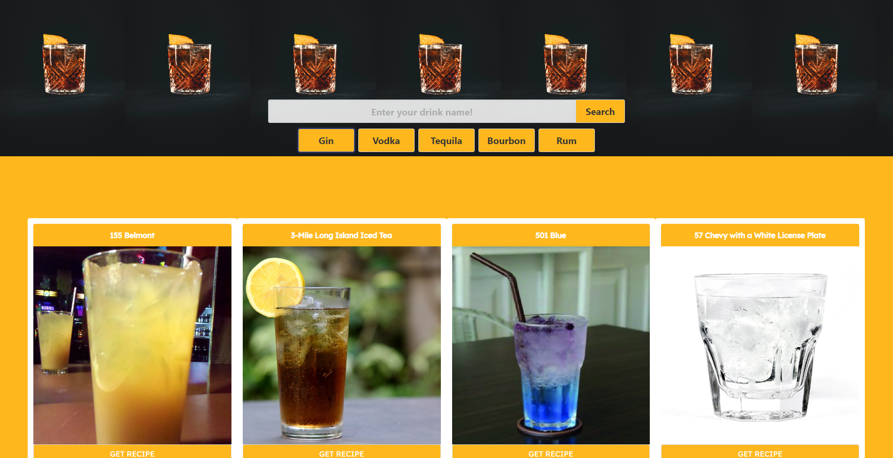

# Make-My-Drink

## Description
A web application that allows users to find recipes for user-specified alcoholic drinks. These recipes will include a picture of the specified drink, and instructions on how to prepare and serve it. It also provides nutritional information that includes, but is not limited to, calorie amount, sodium, sugars (in grams).

The motivation for developing this web application was to help anyone who enjoys alcoholic beverages remain concious of the nutritional values.

## Table of Contents

- [Installation](#installation)
- [Usage](#usage)
- [Credits](#credits)
- [License](#license)

## Installation
Load the webpage in any browser. Here's a link to the webpage: https://brownkasey.github.io/Make-My-Drink/

## Usage
The web application lets you search for any alcoholic drink and get recipes for them and instructions on how to make them.

Head to the webpage: https://brownkasey.github.io/Make-My-Drink/

Answer if you're 21 years old or not.

If you are you will be greeted with the homepage that contains a search bar and buttons. In the search bar, you can search whatever drink you would like to know a recipe for. 

If you decide to click a button, you will be greeted to a list of results with drinks that are made using the alcohol listed on the button.

When you find a drink you want to know the recipe for, click the "Get Recipe" button underneath the picture of the drink.

You will then be brought to a page that looks something like this!

If you scroll you will find a picture of the drink, a nutrition label, another search bar, and the recipe and instructions below that.

In the search bar, you can search for any ingredients and it will tell you about any of the ingredients!

The nutrition label will show you the nutrition values for the drink that you selected.

## Credits

Collaborators:

Clarence: https://github.com/SudoSapien21 

Kasey: https://github.com/brownKasey

Monika: https://github.com/pinkhaze

Sri: https://github.com/Sowchirukuri

CSS Framework: https://bulma.io/

API's Used:

The Cocktaildb: https://www.thecocktaildb.com/api.php

Nutritionix: https://www.nutritionix.com/business/api

CSS Framework Used:

Bulma: https://bulma.io/

Tutorials Used:
Free Code Camp, helped with creating the nutrition label

https://www.freecodecamp.org/learn/2022/responsive-web-design/learn-typography-by-building-a-nutrition-label/step-1

README Template:

https://coding-boot-camp.github.io/full-stack/github/professional-readme-guide

Background Image Credit:

Photo by Marvin Meyer at "https://unsplash.com/@marvelous?utm_source=unsplash&utm_medium=referral&utm_content=creditCopyText
  
Instructor Charlie Werness for help with setting up parallel arrays to concatenate measurement strings with ingredient strings in displayCocktails() function

## License
Refer to LICENSE in the repo!

---
